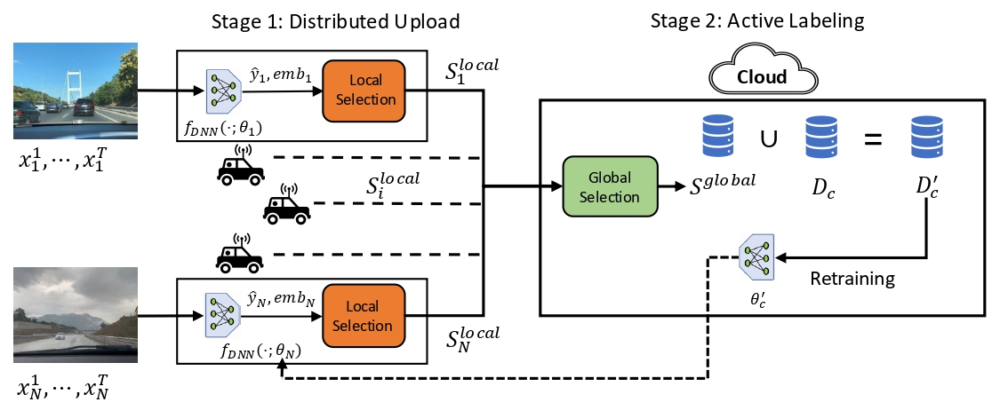

# Distributed Upload and Active Labeling (DUAL): A Scalable Framework for Resource-Constrained Fleet Learning

This repository contains the code for the paper [Distributed Upload and Active Labeling for Resource-Constrained Fleet Learning](https://openreview.net/forum?id=M1e2PEMLp2)

## Table of Contents
- [TLDR](#TLDR)
- [Abstract](#abstract)
- [System Overview](#system-overview)

## TLDR

This work introduces DUAL, a decentralized two-stage data curation framework for resource-constrained robotic fleets that addresses both upload and labeling bottlenecks.

## Abstract

Click to expand

In multi-robot systems, fleets are often deployed to collect data that improves the performance of machine learning models for downstream perception and planning. However, real-world robotic deployments generate vast amounts of data across diverse conditions, while only a small portion can be transmitted or labeled due to limited bandwidth, constrained onboard storage, and high annotation costs. To address these challenges, we propose Distributed Upload and Active Labeling (DUAL), a decentralized, two-stage data collection framework for resource-constrained robotic fleets. In the first stage, each robot independently selects a subset of its local observations to upload under storage and communication constraints. In the second stage, the cloud selects a subset of uploaded data to label, subject to a global annotation budget. We evaluate DUAL on classification tasks spanning multiple sensing modalities, as well as on RoadNet—a real-world dataset we collected from vehicle-mounted cameras for time and weather classification. We further validate our approach in a physical experiment using a Franka Emika Panda robot arm, where it learns to move a red cube to a green bowl. Finally, we test DUAL on trajectory prediction using the nuScenes autonomous driving dataset to assess generalization to complex prediction tasks. Across all settings, DUAL consistently outperforms state-of-the-art baselines, achieving up to 31.1% gain in classification accuracy and a 13% improvement in real-world robotics task completion rates.

## System Overview

**Distributed Upload and Active Labeling (DUAL) Framework:** DUAL operates in two stages: (1) **Distributed Upload**: Each robot independently selects and uploads a subset of its local observations under storage and communication constraints, using submodular maximization to prioritize informative samples. (2) **Active Labeling**: The cloud aggregates all uploaded data and selects the most valuable subset to label under a global annotation budget, again using submodular maximization. This two-stage approach balances scalability with centralized efficiency, allowing robots to operate independently while ensuring high-quality dataset curation.

## Code Structure

To be added soon.